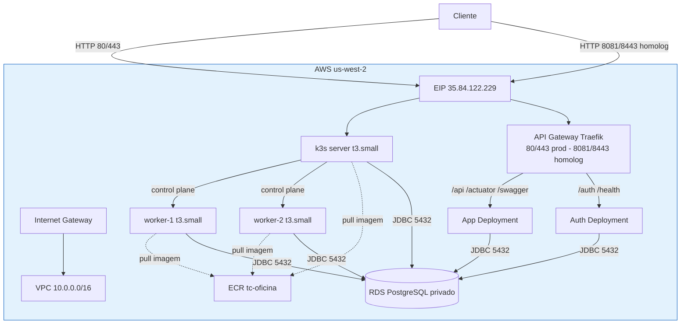

# tc-oficina-infra-k8s

Infraestrutura como código (Terraform) do cluster Kubernetes (**k3s autogerenciado em EC2**)
da aplicação de oficina mecânica **tc-oficina**.

## Escopo

Este repositório provisiona e gerencia:

- **VPC** completa (subnets públicas/privadas, Internet Gateway, route tables)
- **Cluster k3s** real (1 servidor + 2 workers, Ubuntu 24.04, `t3.small`) com bootstrap via `userdata`
- **Elastic IP** para o servidor do cluster (acesso público)
- **Repositório ECR** para as imagens da aplicação e do auth
- **API Gateway Traefik** (ingress do k3s) como ponto único de entrada de todas as requisições
- **Manifestos Kubernetes** da aplicação (namespace, deployments, services, configmap, secret, HPA, IngressRoutes, Middlewares)
- Suporte a **dois ambientes**: produção (`tc-oficina`) e homologação (`tc-oficina-homolog`)

> O banco de dados gerenciado (RDS PostgreSQL) vive no repositório [tc-oficina-infra-db](../tc-oficina-infra-db).

## Estrutura

```
tc-oficina-infra-k8s/
├── terraform/          # Provisionamento do cluster k3s + VPC + ECR + SG
│   ├── provider.tf     # Providers AWS e Kubernetes
│   ├── main.tf         # VPC, k3s server/workers, ECR, SG, EIP
│   ├── variables.tf    # Variáveis (região, instâncias, token)
│   ├── outputs.tf      # Endpoint, ECR URL
│   ├── userdata-server.sh / userdata-worker.sh  # Bootstrap do k3s
│   └── k3s-key.pub     # Chave pública SSH do cluster
├── k8s/                # Manifestos da aplicação + API Gateway (envsubst)
│   ├── namespace.yaml
│   ├── app-deployment.yaml
│   ├── auth-deployment.yaml
│   ├── services.yaml
│   ├── auth-service.yaml
│   ├── configmap.yaml
│   ├── secrets.yaml
│   ├── auth-secrets.yaml
│   ├── hpa.yaml
│   ├── traefik-helmchartconfig.yaml   # Entrypoints do API Gateway Traefik
│   ├── app-ingressroute.yaml          # Rotas /api, /actuator, /swagger → app
│   └── auth-ingressroute.yaml         # Rotas /auth, /health → auth
└── .github/workflows/  # CI/CD (Terraform + Kubeconform)
```

## Tecnologias

- Terraform 1.6+ (AWS provider ~> 5.0)
- k3s (Kubernetes real, `metrics-server` embutido para HPA)
- **Traefik** (API Gateway / ingress controller)
- AWS EC2 / VPC / EIP / ECR
- GitHub Actions (CI/CD)

## CI/CD

O workflow em `.github/workflows/ci.yml`:

1. Valida os manifestos Kubernetes com **Kubeconform** (renderizados via `envsubst`, incluindo CRDs do Traefik)
2. Executa `terraform fmt`, `init` e `validate`
3. Gera `plan` na branch `homologacao`
4. Executa `apply` automático na branch `main`

## API Gateway (Traefik)

Todas as requisições da aplicação passam pelo **API Gateway Traefik** (single entry point):

| Método/Path | Rota interna |
|-------------|--------------|
| `/api/v1/*`, `/actuator/*`, `/swagger-ui/*`, `/v3/api-docs` | `app-service` |
| `/auth`, `/health` | `auth-service` |

Middlewares aplicados: security headers, CORS e rate limiting.

## Ambientes

| Ambiente | Namespace | Entrada do Gateway | App | Auth container |
|----------|-----------|--------------------|-----|----------------|
| Produção | `tc-oficina` | `http://35.84.122.229` (porta 80/443) | app via Traefik | auth via Traefik |
| Homologação | `tc-oficina-homolog` | `http://35.84.122.229:8081` (porta 8081/8443) | app via Traefik | auth via Traefik |

## Diagrama da Arquitetura


