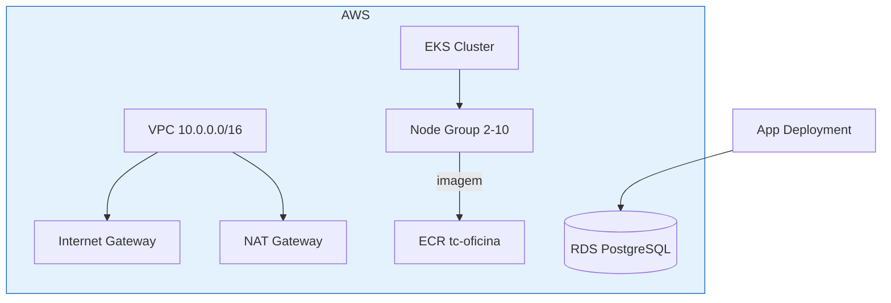

# tc-oficina-infra-k8s

Infraestrutura como código (Terraform) do cluster Kubernetes da aplicação de oficina mecânica **tc-oficina**.

## Escopo

Este repositório provisiona e gerencia:

- **VPC** completa (subnets públicas/privadas, Internet Gateway, NAT Gateway, route tables)
- **Cluster EKS** (Amazon Elastic Kubernetes Service) com alta disponibilidade
- **Node group** com auto scaling (2 a 10 nós)
- **Repositório ECR** para a imagem da aplicação
- **Manifestos Kubernetes** da aplicação (namespace, deployment, service, configmap, secret, HPA)

> O banco de dados gerenciado (RDS PostgreSQL) vive no repositório [tc-oficina-infra-db](../tc-oficina-infra-db).

## Estrutura

```
tc-oficina-infra-k8s/
├── terraform/          # Provisionamento do cluster EKS + VPC + ECR
│   ├── provider.tf     # Providers AWS e Kubernetes
│   ├── main.tf         # VPC, EKS, node group, ECR, IAM
│   ├── variables.tf    # Variáveis (região, cluster, nós)
│   └── outputs.tf      # Endpoint, ECR URL, comando kubeconfig
├── k8s/                # Manifestos da aplicação
│   ├── namespace.yaml
│   ├── app-deployment.yaml
│   ├── services.yaml
│   ├── configmap.yaml
│   ├── secrets.yaml
│   └── hpa.yaml
└── .github/workflows/  # CI/CD (Terraform + Kubeconform)
```

## Tecnologias

- Terraform 1.6+ (AWS provider ~> 5.0, Kubernetes provider ~> 2.30)
- Amazon EKS
- Kubernetes (manifests + HPA)
- GitHub Actions (CI/CD)

## Pré-requisitos

- Conta AWS com permissões para EKS, VPC, ECR e IAM
- `aws` CLI e `terraform` instalados
- Secrets no GitHub: `AWS_ACCESS_KEY_ID`, `AWS_SECRET_ACCESS_KEY` e var `AWS_REGION`

## Como executar

```bash
cd terraform

terraform init
terraform validate
terraform plan -out=tfplan
terraform apply tfplan

# Gerar kubeconfig para usar os manifestos
aws eks update-kubeconfig --name tc-oficina --region us-east-1

# Aplicar manifestos da aplicação
kubectl apply -f k8s/ -R
```

## CI/CD

O workflow em `.github/workflows/ci.yml`:

1. Valida os manifestos Kubernetes com **Kubeconform**
2. Executa `terraform fmt`, `init` e `validate`
3. Gera `plan` na branch `homologacao`
4. Executa `apply` automático na branch `main`

## Diagrama da Arquitetura


